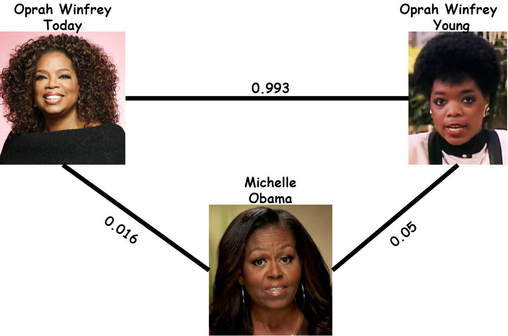

# Facial Recognition with  Age Robustness

Now a days Facial Recogition systems have great accuracies on different datasets, with precisions near 90%. Specifically on the Facial Recognition task, high precision is very important because of the type of solutions that can be solved using this type of models. This solutions may: be access to private facilites using just the face, phone unlocking and recognition of people in grocerie stores. 

The use of Age difference makes the recognition of faces much more difficult for the model. So if a model is robust in detecting faces with age difference, the features it uses for the prediction must be much better than the ones other type of models use, because this features endure time. 



## Methology:
One of the many ways to solve this type of problems is using a Siamise Network Architecture, in this type of networks we make use of a feature backbone, in this case we use the <a href="VGG16">https://keras.io/api/applications/vgg/</a> as the model from which we will extract the features from, by doing this we skip the need to train the model over a big dataset, instead we take advantage that this model has already been trained on and is open-source. By just adding a few Dense layers after the backbone we can train just this two layers in order to apply the Siamise Network Architecture.  


## Installation

Install my-project with npm

```bash
  npm install my-project
  cd my-project
```
    
## Authors

- [@rocholaky](https://www.github.com/rocholaky)

